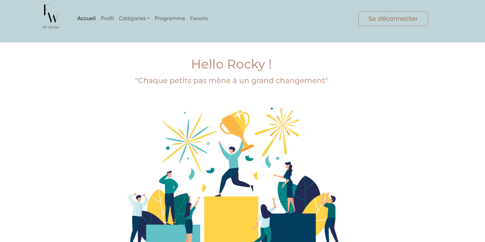
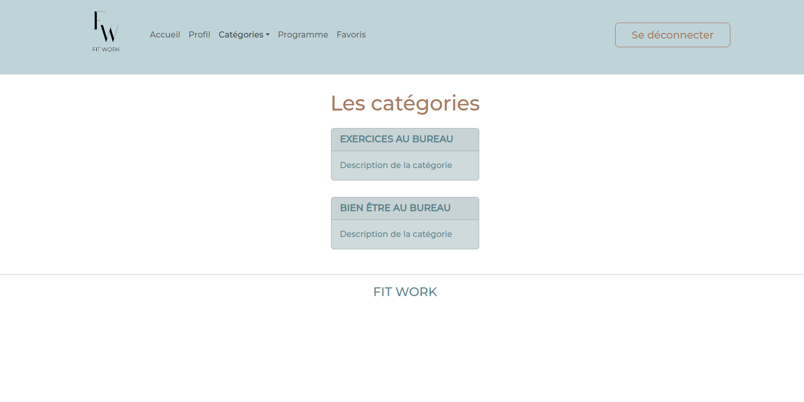
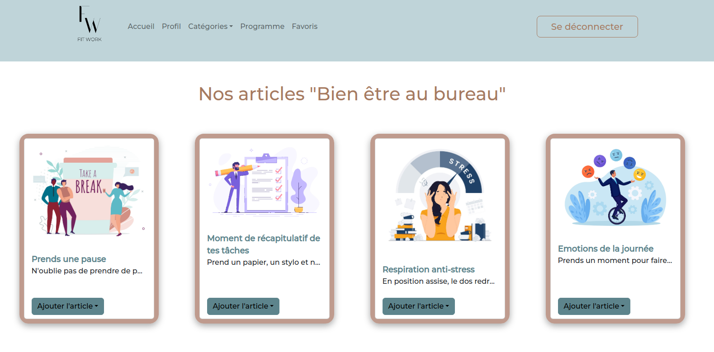

# FitWork


Fitwork est une application de bien-être, afin de se sentir mieux au travail.

Fitwork propose des exercices physiques tel que des petites pauses actives, des conseils de bien-être, des astuces pour pallier à la sédentarité au travail et se sentir globalement mieux durant sa journée au bureau!

L'application vous permet également de créer votre programme, et suivre ses objctifs quotidiens. L'utilisateur pourra ajouter ses articles qui lui convient dans ce programme

Il y a également une page favoris permettant d'ajouter des articles coup de coeurs.


# Contexte

Projet d'un mois qui clôture la fin de notre formation. Le but étant de mettre en pratique nos connaissances acquises sur un projet concret afin de développer une application jusqu'à son déploiement.


# Langages et technologies utilisés

- HTML5, CSS3
- Javascript, Reactjs, Axios
- Nodejs, Postgresql, Sqitch
- Bootstrap React
- Create React App


# Installation 
1. Clone le repo
```
git clone git@github.com:florine89/fitwork-front.git
```
2. Exécuter la commande yarn et yarn start dans votre terminal
3. Suivre le lien dans le terminal 
4. Page d'acceuil : Créer un compte afin de vous connecter et profiter de l'pplication dans son entièreté 
5. Accéder aux articles dans la page catégories et ajoutez vos articles au programme ou Favoris

## Contributeurs


- [Florine FERREIRA](https://github.com/florine88) : Product Owner & dev Front
- [Léa BANI](https://github.com/LeaBani) : Scrum master & dev Front
- [Adnane LAHCENE](https://github.com/LAHCENEAdnane) : Lead Front
- [Wesley FOUSSARD](https://github.com/wesley-foussard) : Lead Back
- [Alexandre BARRE](https://github.com/BarreAlexandre) : Git Master & dev Back

# Screenshots





